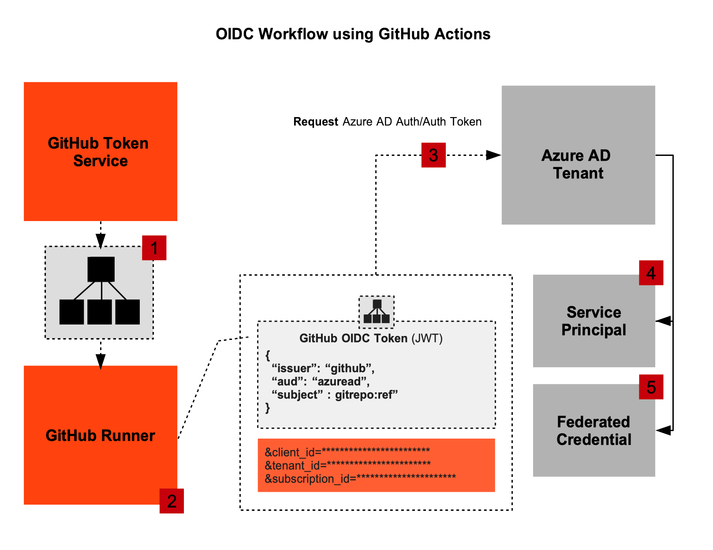
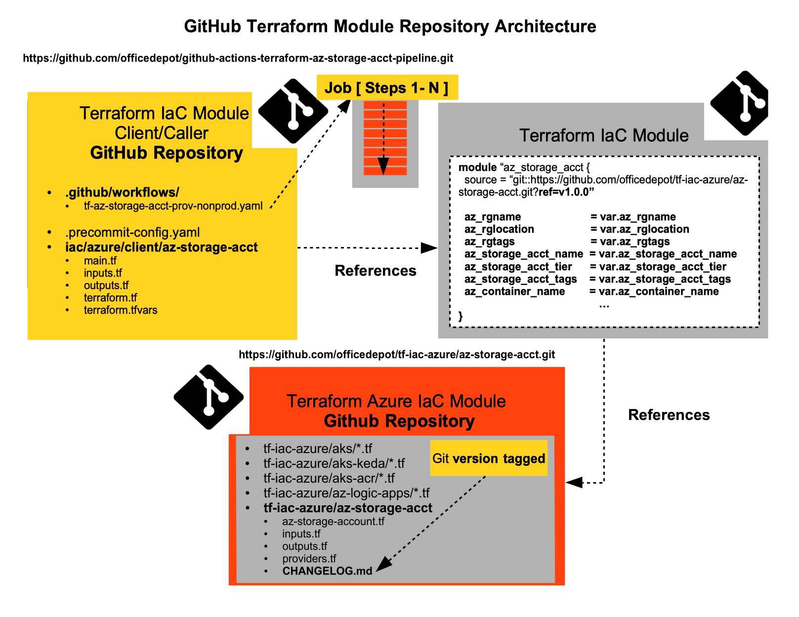
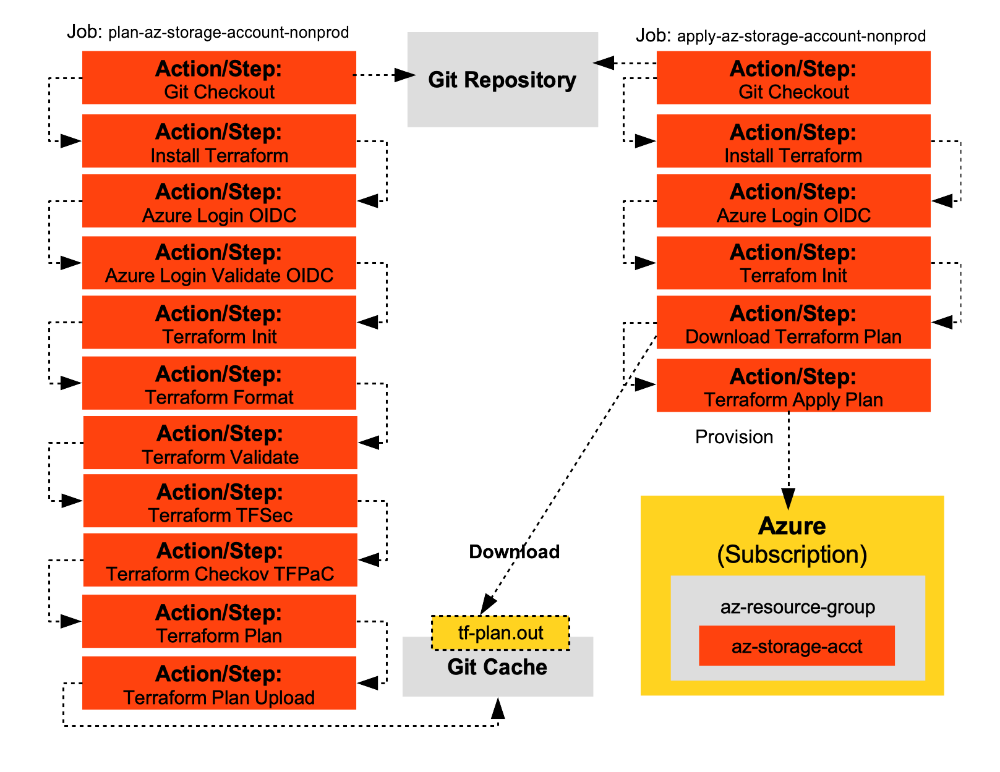

# GitHub Actions and Terraform to Provision Azure Cloud-Native Infrastructure using OIDC and Azure AD Federated Workload Identity
This GitHub repository includes Terraform Azure Modules and Module clients for GitHub Actions Workflows using OpenID Connect (OIDC) and a prerequisite Azure AD App Registration (pre-provisioned Service Principal) and Azure AD Federated Workload Identity to allow GitHub Actions to provision Azure cloud-native infrastructure using Terraform. The goal of this GitHub repository is to cross-train Platform DevOps/DevSecOps divisions not trained using GitHub Actions and Terraform and to adopt this strategy for all OD DevOpS/DevSecOps cloud-native infrastructure provisioning using Terraform IaC.

The following Terraform Modules are included in this GitHub Repository for GitHub Actions Workflow provisioning.

| Azure Resource                       | Terraform Module                  | GitHub Actions Workflow                      |
| -------------------------------------| ----------------------------------|----------------------------------------------|
| Azure Storage Account                | iac/azure/az-storage-account      | tf-az-storage-account-provision-nonprod.yaml |
| Azure Container Registry             | iac/azure/acr                     | tf-acr-provision-nonprod.yaml                |
| Azure Kubernetes Service (AKS)       | iac/azure/aks-cluster             | tf-aks-provision-nonprod.yaml                |
| AKS and Associated ACR               | iac/azure/aks-cluster-acr         | tf-aks-acr-provision-nonprod.yaml            |

## GitHub Actions and Azure AD Federated Workflow Identity Architecture

The following is the authorization/authentication workflow architecture for Azure AD Workload Federated Identity.

The transition to a GitOps authentication/authorization workflow using GitHub Actions and OIDC (through Azure AD and Azure AD Workload Identity Federation) has huge advantages such as avoiding stale credentials after Azure AD Service Principal secrets stored in Azure Key Vault expire or are scheduled for voluntary roll-over which disrupts existing Azure cloud-native infrastructure dependent on these credentials in production. The GitHub Actions OIDC authentication/authorization workflow avoids the following.

- Long-lived credentials susceptible to DDoS 
- Long-lived credentials susceptible to voluntary scheduled roll-over or in-voluntary roll-over
- Long-lived credentials requiring additional cost-inducing governance with Azure Key Vault

The GitHub Actions and OIDC authentication/authorization workflow narrows the liveness of the credential to provision Azure cloud-native resources **ONLY** as long as the GitHub Actions workflow is active. The liveness of the credential expires **AFTER** the GitHub Actions workflow is 100% finished with its provisioning steps. 

The GitHub Actions using Azure AD Workload Federated Identity only requires a Service Principal to collect three required non-sensitive key-value pairs. These are the following:

- `Client ID` -> clientId from Service Principal 
- `Tenant ID` -> tenantId from Service Principal
- `Subscription ID` -> subscriptionId from Service Principal

There is NO required use of `clientSecrets` from the Service Principal through Azure KeyVault. Azure AD Workload Federated Identity is an extension of Azure AD Managed Identity for workflows external to Azure. The external workflow in this case is `GitHub Actions` workflow to provision Terraform IaC for an AKS cluster and associated Azure ACR. Azure AD Workload Federated Identity.

The following architectural diagram shows how GitHub Actions using OIDC provides a credential-less authentication/authorization workflow to provision Azure cloud-native resources using Terraform.

To dynamically provision Terraform IaC for Azure cloud-native resources using GitHub Actions Worflow, the following steps are required. This uses 100% Terraform provisioning automation and 0% use of Ansible playbooks. 

- Create Azure AD App Registration (in Azure App Registration in-turn creates the `Azure AD Service Principal`). The Azure AD Service Principal is associated to a specific `Azure Subscription` and requires a `Scope`. The Azure AD Service Principal associated Scope signifies the role the Service Principal (SP), an Azure cloud service account is allowed to hold such as `Owner` or `Contributor`. The Azure AD Service Principal will require a role assignment as similar to associating a K8s `Service Account`to an RBAC (Role-Based Access Control) resource configuration. 

- Create a Azure AD Workload Federation Identity Token. After the Azure AD App Registration is created, in the Azure Portal under `App Registrations` the associated link to `Certificates` is a section referencing `Federated`.

The entire Terraform IaC repo for this workflow is at this Git repo.
`https://github.com/officedepot/github-actions-terraform-azuread-azurefedid`

## Dissection of GitHub Actions Workflows
TODO
## Dissection of the GitHub Actions Workflows for the Terraform Azure Modules 

The following Git repository architecture is how GitHub Actions references Git versioned Terraform Modules. The following architectural workflow shows the cardinality of the GitHub Actions Workflow as the `client` or `caller` of the Git versioned Terraform Azure Module, the `called on` Terraform Module and its location in Git.

The Git repository of the Terraform Modules for Azure infrastructure shows a series of related and non-related Azure resources. 

- AKS Clusters
- AKS Clusters with KEDA (App-Centric K8s Event-Driven Autoscaling)
- AKS Cluster with strict association with ACR 
- Azure Logic Apps for Containers
- Azure App Services
- Azure Container Apps
- Azure Storage Accounts
- Azure Private Endpoints
- Azure Private Links
- Azure Files Storage 

These are all potentially offered in this Git repo (the repo in the diagram) using Terraform. 

The following Github Actions Workflow shows the Terraform steps in two coordinated GitHub Actions `Jobs`. The Job `plan-az-storage-account-nonprod` calls on a sequence of required GitHub and Terraform `Steps` to provision a Terraform plan file. Provisioning a Terraform plan file prior to directly applying the Terraform Module prevents external changes to the Terraform state in the air-gaps after the plan and prior to the apply. This safeguard reduces a configuration drift upon changes to the state. The plan job produces a plan file to the Git repository cache storage and referenced again in the final Job, `apply-az-storage-account-nonprod`. The GitHub Actions Workflow Jobs will as a default execute in parallel and a prerequisite hook is required to indicate to the next Job to wait and only execute after the previous Job is done. 

## GitHub Actions Advantages Provisioning Terraform

- GitHub Actions DO NOT require third-party plugin updates
- GitHub Actions are natively associated with Git and GitHub
- GitHub Actions hosted-runners are hosted on GitHub Cloud with NO extra configuration 
- GitHub Actions offers self-hosted K8s runners with GitHub Actions Self-Hosted K8s Operator (Helm Chart)
- GitHub Actions are asynchronous and offer superior scaling execution

### GitHub Actions Self-Hosted Runners

GitHub allows for clients to provide own self-hosted servers to execute the GitHub Actions workflows. The self-hosted Github Actions Runners can execute on K8s clusters using a K8s GitHub Actions Self-Hosted Runner Helm Chart or a Cloud-Native VM (Azure VM). 

For Terraform provisioned `Private AKS Clusters` the GitHub Actions Workflow can run on externally default provided GitHub hosted Runners as `Day 0` infrastructure provisioning, however for `Day 1 and Day 2` GitHub Actions Workflows to provision additional infrastructure into the Day 0 Pre-Provisioned Private AKS Cluster, the connections to the AKS cluster will get rejected as ONLY internal Azure VMs can connect to the Private AKS Cluster. To solve this, the GitHub Runner will require self-hosting on this privileged Azure VM. 

